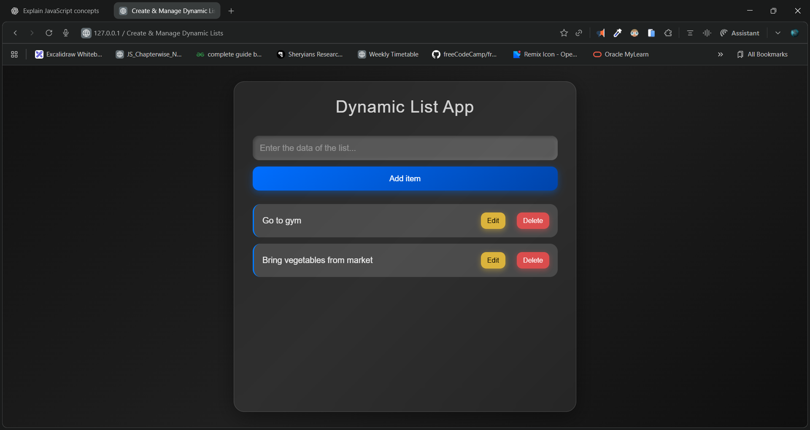

# 📌 **Dynamic List App**

A clean, modern, and animated **Dynamic List Application** built with **HTML, CSS, and Vanilla JavaScript**.
This app allows users to **add**, **edit**, and **delete** items with smooth interactions and a beautiful glass-morphism UI.

---

## 🖼️ **Preview**




---

## 🎥 **Demo Video**


🎬 Watch Demo: [click to watch](./demo.mp4)

---

## 🔗 **Live Demo**


🌍 Live App: https://dileep-kumawat.github.io/Create-Manage-Dynamic-Lists-using-html-css-and-js/

---

# 🚀 Features

### ✅ Add New Items

Simply type and press **Enter** or click **Add**.

### ✏️ Edit Items

Click "Edit" to modify a list item inline.

### ❌ Delete Items

Remove any item instantly with a smooth UI response.

### 💎 Beautiful UI

* Glassmorphism card design
* Clean gradient background
* Smooth animations on add & hover
* Responsive for mobile devices

### ⚡ Real-Time Interactions

* Keyboard event support
* Input preselection on edit
* Smart button disabling

---

# 📂 Project Structure

```
📦 Dynamic List App
 ┣ 📜 index.html
 ┣ 📜 style.css
 ┣ 📜 script.js
 ┗ 📁 assets (optional images/video)
```

---

# 🛠️ Technologies Used

* **HTML5**
* **CSS3 (Glassmorphism + Animations)**
* **JavaScript (DOM Manipulation & Events)**

---

# 📥 Installation & Usage

### 1️⃣ Clone the Repository

```sh
git clone https://github.com/Dileep-kumawat/Create-Manage-Dynamic-Lists-using-html-css-and-js.git
```

### 2️⃣ Navigate Into Folder

```sh
cd dynamic-list-app
```

### 3️⃣ Open the App

Just open:

```
index.html
```

in your browser — no build steps required.

---

# 🧩 Code Highlights

### ✔ Smooth Inline Editing

Automatically selects the text when editing.

### ✔ Event Delegation

Click handling is done efficiently on parent `<li>`.

### ✔ Modern CSS Effects

Glass blur, transitions, keyframe animations, and responsive layout.

---

# 🤝 Contributing

Pull requests are welcome!
Feel free to suggest new features like:

* LocalStorage saving
* Drag & drop sorting
* Dark/light mode toggle
* Task completion system

---

# ⭐ Show Your Support

If you like this project, consider giving it a **star ⭐ on GitHub**!

---

# 📧 Contact

👤 **Dileep kumawat**
- 📧 [dileepkumawat525@gmail.com](mailto:dileepkumawat525@gmail.com)
- 🔗 [LinkedIn](https://www.linkedin.com/in/dileep-kumawat/)
